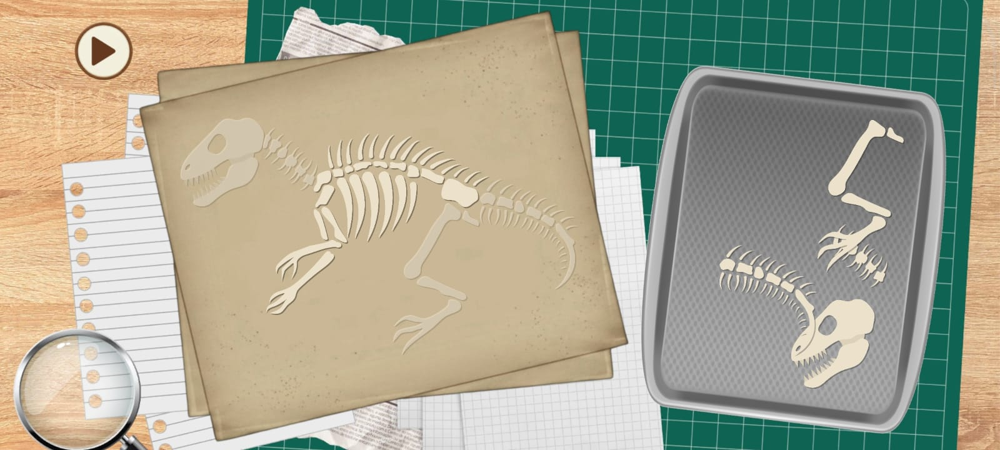
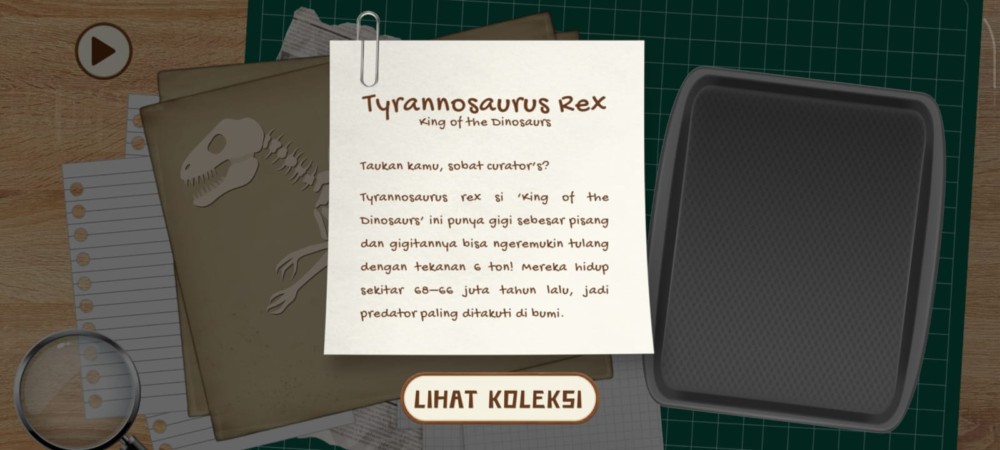

# Paleo Curator – 2D Mobile Educational Game

## Description
Paleo Curator is a 2D mobile educational game developed with Unity.  
Players restore dinosaur fossils using drag-and-drop mechanics, then unlock fun facts and display skeletons in a virtual museum.

## Features
- Drag-and-drop fossil restoration system  
- Snap mechanic for accurate placement  
- Hint system for player guidance  
- Museum collection display  
- Educational facts for each dinosaur species  

## Tech Stack
- Unity (2D mode)  
- C# scripting  
- Custom assets (sprites, UI, audio)  

## Installation
1. Download the latest APK from the **Releases** section.  
2. Transfer the APK to your Android device.  
3. Open the file and install the game.  
4. Launch Paleo Curator and start restoring fossils!  

## Screenshots

 

## Credits
Developed and designed entirely by Desty (desdzlf-creator).  
